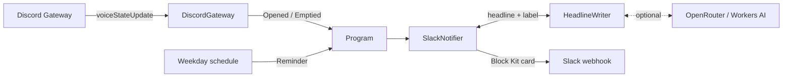

# Virtual Office Notifier

[](https://github.com/ChristopherPHolder/virtual-office-notifier/actions/workflows/ci.yml)

Posts to Slack when someone opens our Discord "virtual office" voice channel, and again when it empties out, so people know when they can jump in. On weekdays it also posts a reminder to come hang out.

- [Features](#features)
- [What it posts](#what-it-posts)
- [How it works](#how-it-works)
- [Getting started](#getting-started)
- [Configuration](#configuration)
- [Development](#development)
- [Deployment](#deployment)
- [Troubleshooting](#troubleshooting)
- [Privacy](#privacy)
- [Contributing](#contributing)
- [License](#license)

## Features

- **Announces the edges of a session only.** The first person in opens the office and the last person out empties it. Joins and leaves in between aren't announced, to keep the Slack channel quiet.
- **Recaps each session** with how long the office was open and how many different people came by.
- **Weekday reminder** at 11:15 UTC+2.
- **Slack cards** with a button that opens the office in Discord, the opener's avatar, and times shown in each reader's own time zone.
- **AI-written headlines** from free models on OpenRouter or Cloudflare Workers AI, falling back to fixed phrasings.
- **Restart-safe.** It counts whoever is already in the channel at startup, so a restart mid-session doesn't announce the office opening again.
- **Keeps going when Slack doesn't.** Failed posts are retried with backoff and logged, and never crash the process.

## What it posts

Each post is a Block Kit card. With the fixed phrasings, they look like this:

> 🎙️ **Ada** opened the virtual office — everyone's welcome to join!
>
> `🎧 Join the office`
>
> 🔊 Opened on Discord at 4:05 PM

> 🪑 The virtual office is empty right now — jump in and get it going!
>
> **Open for** 2h 14m · **Stopped by** 5 people
>
> `🎧 Jump in`
>
> 🔇 Emptied at 6:19 PM

> ⏰ Daily reminder: come hang out in the virtual office!
>
> `🎧 Join the office`

When an AI model writes the headline and button label, the card adds a `✨ Headline by <model>` line. See [AI headlines](#ai-headlines).

### When it posts

| Post | Trigger |
|---|---|
| Opened | The first person joins the empty office channel. Moving in from another voice channel counts as joining. |
| Emptied | The last person leaves. Moving to another voice channel counts as leaving. The recap is left out for a session that was already under way when the bot started, since it missed the beginning. |
| Reminder | Weekdays at 11:15 UTC+2. It's a fixed offset, so it doesn't shift with daylight saving. Skipped if the office channel wasn't found at startup, since there's nothing to link to. |

It only watches the one office channel and ignores bots. Mute, deafen and video changes are ignored.

The fixed opened and emptied headlines are picked at random from a few phrasings. The reminder rotates through its phrasings by date, so each one comes up once before any repeats.

The original design is in [issue #1](https://github.com/ChristopherPHolder/virtual-office-notifier/issues/1).

## How it works

Discord only pushes voice-state changes over its Gateway WebSocket, so this is an always-on Node.js process rather than a webhook or serverless function. It's written in TypeScript with [Effect](https://effect.website) v4, uses [discord.js](https://discord.js.org) to receive `voiceStateUpdate` events, and posts to a Slack Incoming Webhook.



Events are handled one at a time, so one that arrives while a Slack post is being retried waits its turn and messages stay in order. Each post times out after 10 seconds and is retried up to 4 times with jittered exponential backoff from 1 second, or after Slack's `Retry-After` when rate-limited. A revoked webhook (403, 404 or 410) or a rejected payload isn't retried. Either way the failure is logged and the next event is handled as normal.

| Module | Responsibility |
|---|---|
| [`src/main.ts`](src/main.ts) | Entry point. Provides the layers and runs the program. |
| [`src/Program.ts`](src/Program.ts) | Merges office events with reminders and posts each one to Slack. |
| [`src/DiscordGateway.ts`](src/DiscordGateway.ts) | Logs in to Discord, finds the office channel and turns voice-state updates into office events. |
| [`src/OfficeEvent.ts`](src/OfficeEvent.ts) | The event types and the occupancy tracking that decides when the office opens or empties. |
| [`src/Reminder.ts`](src/Reminder.ts) | The weekday reminder schedule. |
| [`src/HeadlineWriter.ts`](src/HeadlineWriter.ts) | Asks the AI providers for a headline and button label, and checks the reply. |
| [`src/SlackMessage.ts`](src/SlackMessage.ts) | Builds the Block Kit message, including the fixed phrasings. |
| [`src/SlackNotifier.ts`](src/SlackNotifier.ts) | Posts to the webhook, with retries and error classification. |
| [`src/Database.ts`](src/Database.ts) | Connects to Postgres and runs the migrations in the background, retrying until it works. |
| [`src/migrations.ts`](src/migrations.ts) | The database migrations, bundled into the app. |
| [`src/SupabaseCa.ts`](src/SupabaseCa.ts) | Supabase's root certificate, which Node doesn't trust by default. |
| [`src/Config.ts`](src/Config.ts) | Environment variables and the default model lists. |

## Getting started

You'll need Node 26 (see `.nvmrc`), pnpm, a [Discord bot](#discord-bot) and a [Slack webhook](#slack-webhook).

```bash
git clone https://github.com/ChristopherPHolder/virtual-office-notifier.git
cd virtual-office-notifier
pnpm install
cp .env.example .env   # then fill in the values
pnpm dev
```

Once it logs `Watching the virtual office`, join the office channel and the post should show up in Slack.

> [!WARNING]
> Use a separate bot and webhook for local runs while production is running. Two copies watching the same channel post every announcement twice.

## Configuration

All configuration comes from environment variables. Copy `.env.example` to `.env` for local runs. `.env` is git-ignored and must never be committed.

| Variable | Required | Description |
|---|---|---|
| `DISCORD_BOT_TOKEN` | Yes | Bot token from the Discord Developer Portal. Secret. |
| `DISCORD_OFFICE_CHANNEL_ID` | Yes | ID of the office voice channel (Developer Mode → right-click the channel → Copy Channel ID). |
| `SLACK_WEBHOOK_URL` | Yes | Slack Incoming Webhook URL. Secret: anyone with it can post to the channel. |
| `OPENROUTER_API_KEY` | No | [OpenRouter](https://openrouter.ai/settings/keys) API key for AI headlines. Secret. |
| `OPENROUTER_MODELS` | No | Comma-separated OpenRouter models to try, preferred first. Defaults to `DEFAULT_OPENROUTER_MODELS` in [`src/Config.ts`](src/Config.ts). |
| `CLOUDFLARE_ACCOUNT_ID` | No | Cloudflare account ID, for AI headlines from Workers AI. Needs `CLOUDFLARE_API_TOKEN` too. |
| `CLOUDFLARE_API_TOKEN` | No | Workers AI API token. Secret. |
| `CLOUDFLARE_MODELS` | No | Comma-separated Workers AI models to try, preferred first. Defaults to `DEFAULT_CLOUDFLARE_MODELS` in [`src/Config.ts`](src/Config.ts), all within the free daily allocation. |
| `DATABASE_URL` | No | Supabase session pooler connection string, for the [database](#database). Secret. Without it, nothing is stored. |

The process exits at startup with an error naming the variable if a required one is missing. A blank optional key, account ID or database URL counts as unset.

`OPENROUTER_MODELS` and `CLOUDFLARE_MODELS` aren't passed through the deploy, so production always uses the defaults. Change those in `src/Config.ts`.

### Discord bot

1. Create an application at <https://discord.com/developers/applications> and add a bot. Revealing the token requires the account password.
2. Under **Bot**, turn off **Public Bot**. No privileged intents are needed; the bot only uses `Guilds` and `GuildVoiceStates`.
3. Under **OAuth2 → URL Generator**, pick the `bot` scope with the **View Channels** permission, open the URL and add the bot to the server.

### Slack webhook

1. Create an app at <https://api.slack.com/apps> → **From scratch** → pick the workspace.
2. **Features → Incoming Webhooks** → turn it on → **Add New Webhook to Workspace** → pick the channel → **Allow**. Webhooks can't post to `#general`.

### AI headlines

Optional. With neither provider configured, every post uses the fixed phrasings.

Every post (opened, emptied and the reminder) gets a fresh headline and join button label from a free AI model, and the card credits the model that wrote them.

**What the model sees and returns**

- The model never sees anyone's name. For an opened office it writes a `{name}` placeholder that's filled in afterwards, and the other posts don't name anyone.
- The reply must be exactly two lines: a headline of up to 160 characters and a button label of up to 30. The headline has the placeholder exactly once for an opened office and not at all otherwise, and neither line may contain Slack link syntax. The reply is escaped before it's posted.

**Which model writes it**

- Each post picks OpenRouter or Workers AI at random to go first and falls back to the other, using whichever are configured.
- Within a provider, models are tried one at a time in a random order. The first in its list goes first at least half the time (`openrouter/free` by default, which lets OpenRouter choose any free model that's up).
- A model that fails, takes longer than a minute, or replies with something unusable is skipped for the next one, and each skip is logged with the model and the reason.
- If OpenRouter says the key's daily free limit is used up (50 requests a day without credits, 1,000 with at least $10 of credit), the rest of OpenRouter's models are skipped, since they'd all be refused too, and Workers AI is tried if it hasn't been already.
- If every model fails, the post goes out with the fixed headline and label.

#### OpenRouter

Create a key at <https://openrouter.ai/settings/keys> and put it in `OPENROUTER_API_KEY`.

Free models come and go on OpenRouter. To change the list, pick from the [free models](https://openrouter.ai/models?max_price=0) and set `OPENROUTER_MODELS`, preferred model first.

#### Cloudflare Workers AI

1. Sign up at <https://dash.cloudflare.com/sign-up/workers-and-pages>. New accounts are on the Workers Free plan.
2. Go to **Workers AI** → **Use REST API** → **Create a Workers AI API Token**, and copy the token into `CLOUDFLARE_API_TOKEN`.
3. Copy the **Account ID** from the same page into `CLOUDFLARE_ACCOUNT_ID`.

Workers AI includes 10,000 Neurons a day for free, which covers a few hundred headlines on the default models.

### Database

Optional, and not used for anything yet. It's the groundwork for recording office voice activity ([#10](https://github.com/ChristopherPHolder/virtual-office-notifier/issues/10)). The bot connects to a Postgres database on [Supabase](https://supabase.com) and keeps everything in an `office` schema, out of the `public` schema that Supabase serves through its REST API.

1. Create a project at <https://supabase.com/dashboard>.
2. Click **Connect**, pick the **Session pooler** connection string, and put it in `DATABASE_URL` with the database password filled in. Percent-encode any special characters in the password.

Use the session pooler, not the direct connection: the direct one is IPv6-only unless the project has the IPv4 add-on, and GCP VMs only have IPv4 by default. The transaction pooler (port 6543) doesn't support the prepared statements the client uses.

The database can never stop the announcements:

- Connecting happens in the background after startup, so the bot runs normally while it's down.
- If it can't connect or run the migrations, it retries in bursts of 5 attempts 1, 2, 4, 8 and 16 seconds apart, then waits an hour before the next burst. Each failed attempt is logged with what went wrong.
- Once it's connected, it logs `Connected to the database`.

Migrations live in [`src/migrations.ts`](src/migrations.ts) and run once each on the first successful connection. They only ever add tables and columns. Nothing stored is ever deleted.

The connection is encrypted and checked against Supabase's own root certificate in [`src/SupabaseCa.ts`](src/SupabaseCa.ts), which expires in April 2031.

## Development

| Command | What it does |
|---|---|
| `pnpm dev` | Run from source with `.env`. |
| `pnpm typecheck` | Type-check with TypeScript 7 and the Effect diagnostics. |
| `pnpm lint` | Lint with oxlint. `pnpm lint:fix` applies the automatic fixes. |
| `pnpm test` | Run the tests with Vitest. |
| `pnpm build` | Bundle to `dist/main.js` with a source map. |
| `pnpm start` | Run the bundle with `.env`. |

CI runs typecheck, lint, test and build on every push and pull request.

The tests run the program against fakes for Discord, the Slack webhook and the AI models, so they need no tokens or network access. `DiscordGateway.layerTest` feeds voice-state updates from a queue through the same occupancy tracking the real gateway uses.

TypeScript is pinned to the exact version `@effect/tsgo` supports, so upgrade the two together. The `prepare` script patches it on install.

The lint rules in `tools/oxlint/anti-slop` are vendored from [dmmulroy/anti-slop](https://github.com/dmmulroy/anti-slop). [`UPSTREAM.md`](tools/oxlint/anti-slop/UPSTREAM.md) records the commit they were copied from.

## Deployment

Runs on a GCP Always Free `e2-micro` VM under systemd. There must be exactly one running copy, otherwise every announcement is posted twice.

Deploys only happen from CI: merging a pull request into `main` runs the checks and then deploys. There are no manual deploys.

### First-time VM setup

1. Create the VM (Debian 12, `e2-micro`, `us-central1`):

   ```bash
   gcloud compute instances create virtual-office-notifier \
     --machine-type=e2-micro --zone=us-central1-a \
     --image-family=debian-12 --image-project=debian-cloud
   ```

2. SSH in (`gcloud compute ssh virtual-office-notifier --zone=us-central1-a`) and install Node 26 from NodeSource:

   ```bash
   curl -fsSL https://deb.nodesource.com/setup_26.x | sudo bash -
   sudo apt-get install -y nodejs
   ```

3. Create the service user and app directory:

   ```bash
   sudo useradd --system --no-create-home --shell /usr/sbin/nologin notifier
   sudo mkdir -p /opt/virtual-office-notifier
   ```

The deploy writes the env file and installs the systemd unit, so there's nothing else to do on the VM. Set up CI below; the first deploy starts the service.

### Continuous deployment

The `deploy` job in [`.github/workflows/ci.yml`](.github/workflows/ci.yml) authenticates to GCP through Workload Identity Federation, so there's no service account key to leak, and only pushes to `main` on this repo can get a token.

One-time setup, from the repo root with `gcloud` on the right project and `gh` logged in to the repo owner's account:

```bash
scripts/setup-ci.sh
```

This creates a `github-deploy` service account and a Workload Identity pool trusting this repo's `main` branch, turns on OS Login for the VM, and grants the account SSH and sudo there. It then stores these repository secrets:

| Secret | Source |
|---|---|
| `GCP_WORKLOAD_IDENTITY_PROVIDER` | The Workload Identity provider created above |
| `GCP_SERVICE_ACCOUNT` | The `github-deploy` service account email |
| `DISCORD_BOT_TOKEN`, `DISCORD_OFFICE_CHANNEL_ID`, `SLACK_WEBHOOK_URL` | Your local `.env` |
| `OPENROUTER_API_KEY`, `CLOUDFLARE_ACCOUNT_ID`, `CLOUDFLARE_API_TOKEN`, `DATABASE_URL` | Optional, your local `.env` |

GitHub secrets are the source of truth for the app's configuration. To change a value, update the secret and re-run the latest `CI` workflow on `main`:

```bash
gh secret set SLACK_WEBHOOK_URL
```

### What a deploy does

The `deploy` job runs [`scripts/deploy.ts`](scripts/deploy.ts), which:

1. Writes the env file from the configuration variables into a temporary directory, so secrets never land in the working tree.
2. Bundles the app.
3. Copies `dist/main.js`, its source map, the systemd unit and the env file to the VM.
4. Installs them under `/opt/virtual-office-notifier` and `/etc`, reloads systemd and restarts the service.
5. Waits 15 seconds and fails, printing the last log lines, if the service isn't running.

The [unit](deploy/virtual-office-notifier.service) runs as the unprivileged `notifier` user with systemd's sandboxing turned on. It restarts 30 seconds after a crash and gives up after 5 failed starts in 10 minutes, so a bad token doesn't keep hammering Discord's login.

### Logs

```bash
gcloud compute ssh virtual-office-notifier --zone=us-central1-a -- journalctl -u virtual-office-notifier -f
```

There's no monitoring or alerting. If announcements stop, check the logs.

## Troubleshooting

| Symptom | Cause |
|---|---|
| Exits at startup naming a variable | It's missing or empty. Check `.env` locally, or the GitHub secret in production. |
| `Office voice channel not found` in the logs | `DISCORD_OFFICE_CHANNEL_ID` is wrong, or the bot isn't in the server or can't view the channel. It keeps running in case the bot is added later, but reminders stay off until it restarts. |
| Every announcement shows up twice | Two copies are running, for example `pnpm dev` with the production token and webhook. |
| `Slack rejected the post` with `WebhookRevoked` | The webhook was removed or the Slack app uninstalled. Create a new webhook and update `SLACK_WEBHOOK_URL`. |
| Posts always use the fixed headlines | Every AI model is failing. Look for `AI model couldn't write a headline` warnings and their reason. `DailyLimit` means the OpenRouter key has used up its free requests for the day. |
| `Couldn't set up the database, retrying` in the logs | The bot can't reach the database or run the migrations. The `reason` says why, for example a wrong password in `DATABASE_URL` or a paused Supabase project. Announcements carry on regardless. |
| The service has stopped and isn't restarting | systemd gave up after 5 failed starts in 10 minutes. Check the logs, then merge a fix, or update the secret and re-run the latest `CI` workflow on `main`. |

## Privacy

This broadcasts people's presence to a wider audience. The opening post shows who opened the office, with their Discord display name and avatar, and the empty post shows how long it was open and how many people came by. Tell the team before turning it on.

The AI providers only get the instructions and a few example headlines, never names or anything else from Discord.

## Contributing

Issues and pull requests are welcome. See [CONTRIBUTING.md](CONTRIBUTING.md) for how to set up, what the checks are and what a pull request needs. To report a security problem, follow [SECURITY.md](SECURITY.md) instead of opening an issue.

## License

[0BSD](LICENSE). Use it for anything, with no conditions. It comes with no warranty, and I'm not liable for anything that comes of using it.
