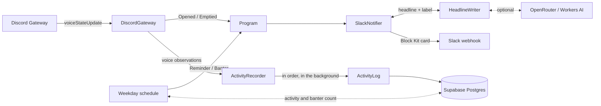

# Virtual Office Notifier

[](https://github.com/ChristopherPHolder/virtual-office-notifier/actions/workflows/ci.yml)

Posts to Slack when someone opens our Discord "virtual office" voice channel, and again when it empties out, so people know when they can jump in. On weekdays it also posts a reminder to come hang out, and a few bits of AI-written banter about what's been going on in the office. It also records what happens in the office channel to a Postgres database.

- [Features](#features)
- [What it posts](#what-it-posts)
- [How it works](#how-it-works)
- [Getting started](#getting-started)
- [Configuration](#configuration)
- [Development](#development)
- [Deployment](#deployment)
- [Troubleshooting](#troubleshooting)
- [Privacy](#privacy)
- [Contributing](#contributing)
- [License](#license)

## Features

- **Announces the edges of a session only.** The first person in opens the office and the last person out empties it. Joins and leaves in between aren't announced, to keep the Slack channel quiet.
- **Recaps each session** with how long the office was open and how many different people came by.
- **Weekday reminder** at 11:15 UTC+2.
- **Office banter.** Up to five times a working day, at random, an AI model reads what happened in the office and posts something playful about it.
- **Slack cards** with a button that opens the office in Discord, the opener's avatar, and times shown in each reader's own time zone.
- **AI-written headlines** from free models on OpenRouter or Cloudflare Workers AI, falling back to fixed phrasings.
- **Restart-safe.** It counts whoever is already in the channel at startup, so a restart mid-session doesn't announce the office opening again.
- **Keeps going when Slack doesn't.** Failed posts are retried with backoff and logged, and never crash the process.
- **Records voice activity** in the office channel to a [database](#database): joins, leaves, mute, deafen, camera and streaming, exactly as Discord reports them. The database can never stop the announcements.
- **Optional Sentry monitoring** of errors, traces and logs.

## What it posts

Each post is a Block Kit card. With the fixed phrasings, they look like this:

> 🎙️ **Ada** opened the virtual office — everyone's welcome to join!
>
> `🎧 Join the office`
>
> 🔊 Opened on Discord at 4:05 PM

> 🪑 The virtual office is empty right now — jump in and get it going!
>
> **Open for** 2h 14m · **Stopped by** 5 people
>
> `🎧 Jump in`
>
> 🔇 Emptied at 6:19 PM

> ⏰ Daily reminder: come hang out in the virtual office!
>
> `🎧 Join the office`

When an AI model writes the headline and button label, the card adds a `✨ Headline by <model>` line. See [AI headlines](#ai-headlines).

Banter is always written by an AI model, from what's actually happened in the office:

> 🎬 Wednesday's crew arrived like a flash mob: Barbara, Alan, Grace and Linus all joined within 8 minutes, cameras snapped on in unison, then off together 40 minutes later.
>
> `🚪 Join the ensemble`
>
> ✨ Banter by nvidia/nemotron-3-ultra-550b-a55b:free · 🤖 AI is a hallucination machine.

### When it posts

| Post | Trigger |
|---|---|
| Opened | The first person joins the empty office channel. Moving in from another voice channel counts as joining. |
| Emptied | The last person leaves. Moving to another voice channel counts as leaving. The recap is left out for a session that was already under way when the bot started, since it missed the beginning. |
| Reminder | Weekdays at 11:15 UTC+2. It's a fixed offset, so it doesn't shift with daylight saving. Skipped if the office channel wasn't found at startup, since there's nothing to link to. |
| Banter | At random, between 1 and 2½ hours apart, from 09:00 to 18:00 UTC+2 on weekdays, and at most 5 a day. See [Banter](#banter). |

It only watches the one office channel and ignores bots. Mute, deafen and video changes aren't announced, only [recorded](#database).

The fixed opened and emptied headlines are picked at random from a few phrasings. The reminder rotates through its phrasings by date, so each one comes up once before any repeats.

The original design is in [issue #1](https://github.com/ChristopherPHolder/virtual-office-notifier/issues/1).

## How it works

Discord only pushes voice-state changes over its Gateway WebSocket, so this is an always-on Node.js process rather than a webhook or serverless function. It's written in TypeScript with [Effect](https://effect.website) v4, uses [discord.js](https://discord.js.org) to receive `voiceStateUpdate` events, and posts to a Slack Incoming Webhook.



Events are handled one at a time, so one that arrives while a Slack post is being retried waits its turn and messages stay in order. Each post times out after 10 seconds and is retried up to 4 times with jittered exponential backoff from 1 second, or after Slack's `Retry-After` when rate-limited. A revoked webhook (403, 404 or 410) or a rejected payload isn't retried. Either way the failure is logged and the next event is handled as normal.

Recording runs alongside, in its own fiber, so a slow Slack post never holds it up. See [Database](#database) for how it handles the database being down.

| Module | Responsibility |
|---|---|
| [`src/main.ts`](src/main.ts) | Entry point. Provides the layers and runs the program. |
| [`src/Program.ts`](src/Program.ts) | Merges office events with reminders and posts each one to Slack, and records voice activity alongside. |
| [`src/DiscordGateway.ts`](src/DiscordGateway.ts) | Logs in to Discord, finds the office channel and turns voice-state updates into office events and observations to record. |
| [`src/OfficeEvent.ts`](src/OfficeEvent.ts) | The event types and the occupancy tracking that decides when the office opens or empties. |
| [`src/Reminder.ts`](src/Reminder.ts) | The weekday reminder schedule. |
| [`src/Banter.ts`](src/Banter.ts) | When to post banter, which stretch of activity it covers, and the log the AI model reads. |
| [`src/OfficeHistory.ts`](src/OfficeHistory.ts) | Reads the recorded activity and who's in, and keeps count of the banter posted. |
| [`src/Storage.ts`](src/Storage.ts) | Sets up the database once for recording and reading, or turns both off without `DATABASE_URL`. |
| [`src/HeadlineWriter.ts`](src/HeadlineWriter.ts) | Asks the AI providers for a headline or banter and a button label, and checks the reply. |
| [`src/SlackMessage.ts`](src/SlackMessage.ts) | Builds the Block Kit message, including the fixed phrasings. |
| [`src/SlackNotifier.ts`](src/SlackNotifier.ts) | Posts to the webhook, with retries and error classification. |
| [`src/VoiceObservation.ts`](src/VoiceObservation.ts) | Decides which voice-state updates are worth recording. |
| [`src/ActivityRecorder.ts`](src/ActivityRecorder.ts) | Buffers observations and writes them in order, retrying outages and setting aside rows the database rejects. |
| [`src/ActivityLog.ts`](src/ActivityLog.ts) | The repository: the SQL that writes sessions, members and snapshots, and tells outages from bad rows. |
| [`src/Database.ts`](src/Database.ts) | Connects to Postgres and runs the migrations in the background, retrying until it works. |
| [`src/migrations.ts`](src/migrations.ts) | The tables and the `voice_activity` view, bundled into the app. |
| [`src/SupabaseCa.ts`](src/SupabaseCa.ts) | Supabase's root certificate, which Node doesn't trust by default. |
| [`src/Config.ts`](src/Config.ts) | Environment variables and the default model lists. |
| [`src/Observability.ts`](src/Observability.ts) | Sends errors, traces and logs to Sentry when it's configured. |

## Getting started

You'll need Node 26 (see `.nvmrc`), pnpm, a [Discord bot](#discord-bot) and a [Slack webhook](#slack-webhook).

```bash
git clone https://github.com/ChristopherPHolder/virtual-office-notifier.git
cd virtual-office-notifier
pnpm install
cp .env.example .env   # then fill in the values
pnpm dev
```

Once it logs `Watching the virtual office`, join the office channel and the post should show up in Slack.

> [!WARNING]
> Use a separate bot and webhook for local runs while production is running. Two copies watching the same channel post every announcement twice.

## Configuration

All configuration comes from environment variables. Copy `.env.example` to `.env` for local runs. `.env` is git-ignored and must never be committed.

| Variable | Required | Description |
|---|---|---|
| `DISCORD_BOT_TOKEN` | Yes | Bot token from the Discord Developer Portal. Secret. |
| `DISCORD_OFFICE_CHANNEL_ID` | Yes | ID of the office voice channel (Developer Mode → right-click the channel → Copy Channel ID). |
| `SLACK_WEBHOOK_URL` | Yes | Slack Incoming Webhook URL. Secret: anyone with it can post to the channel. |
| `OPENROUTER_API_KEY` | No | [OpenRouter](https://openrouter.ai/settings/keys) API key for AI headlines. Secret. |
| `OPENROUTER_MODELS` | No | Comma-separated OpenRouter models to try, preferred first. Defaults to `DEFAULT_OPENROUTER_MODELS` in [`src/Config.ts`](src/Config.ts). |
| `OPENROUTER_BANTER_MODELS` | No | Comma-separated OpenRouter models to try for [banter](#banter), preferred first. Defaults to `DEFAULT_OPENROUTER_BANTER_MODELS` in [`src/Config.ts`](src/Config.ts). |
| `CLOUDFLARE_ACCOUNT_ID` | No | Cloudflare account ID, for AI headlines from Workers AI. Needs `CLOUDFLARE_API_TOKEN` too. |
| `CLOUDFLARE_API_TOKEN` | No | Workers AI API token. Secret. |
| `CLOUDFLARE_MODELS` | No | Comma-separated Workers AI models to try, preferred first. Defaults to `DEFAULT_CLOUDFLARE_MODELS` in [`src/Config.ts`](src/Config.ts), all within the free daily allocation. |
| `DATABASE_URL` | Deploys only | Supabase session pooler connection string, for the [database](#database). Secret. Optional locally, where leaving it out records nothing; the deploy fails without it. |
| `SENTRY_DSN` | No | [Sentry](#monitoring) project DSN. Without it, nothing is sent to Sentry. |
| `SENTRY_ENVIRONMENT` | No | Environment to tag Sentry data with. Defaults to `development`; the deploy sets `production`. |
| `SENTRY_RELEASE` | No | Release to tag Sentry data with. The deploy sets it to the commit SHA. |

The process exits at startup with an error naming the variable if a required one is missing. A blank optional key, account ID or database URL counts as unset.

`OPENROUTER_MODELS`, `OPENROUTER_BANTER_MODELS` and `CLOUDFLARE_MODELS` aren't passed through the deploy, so production always uses the defaults. Change those in `src/Config.ts`.

### Discord bot

1. Create an application at <https://discord.com/developers/applications> and add a bot. Revealing the token requires the account password.
2. Under **Bot**, turn off **Public Bot**. No privileged intents are needed; the bot only uses `Guilds` and `GuildVoiceStates`.
3. Under **OAuth2 → URL Generator**, pick the `bot` scope with the **View Channels** permission, open the URL and add the bot to the server.

### Slack webhook

1. Create an app at <https://api.slack.com/apps> → **From scratch** → pick the workspace.
2. **Features → Incoming Webhooks** → turn it on → **Add New Webhook to Workspace** → pick the channel → **Allow**. Webhooks can't post to `#general`.

### AI headlines

Optional. With neither provider configured, every post uses the fixed phrasings.

Every post (opened, emptied and the reminder) gets a fresh headline and join button label from a free AI model, and the card credits the model that wrote them.

**What the model sees and returns**

- The model never sees anyone's name. For an opened office it writes a `{name}` placeholder that's filled in afterwards, and the other posts don't name anyone.
- The reply must be exactly two lines: a headline of up to 160 characters and a button label of up to 30. The headline has the placeholder exactly once for an opened office and not at all otherwise, and neither line may contain Slack link syntax. The reply is escaped before it's posted.
- Nothing checks that what the model says is true, and it does get things wrong, so every bit of banter says it's AI-written and may be made up.

**Which model writes it**

- Each post picks OpenRouter or Workers AI at random to go first and falls back to the other, using whichever are configured.
- Within a provider, models are tried one at a time in a random order. The first in its list goes first at least half the time (`openrouter/free` by default, which lets OpenRouter choose any free model that's up).
- A model that fails, takes longer than a minute, or replies with something unusable is skipped for the next one, and each skip is logged with the model and the reason.
- If OpenRouter says the key's daily free limit is used up (50 requests a day without credits, 1,000 with at least $10 of credit), the rest of OpenRouter's models are skipped, since they'd all be refused too, and Workers AI is tried if it hasn't been already.
- If every model fails, the post goes out with the fixed headline and label.

#### OpenRouter

Create a key at <https://openrouter.ai/settings/keys> and put it in `OPENROUTER_API_KEY`.

Free models come and go on OpenRouter. To change the list, pick from the [free models](https://openrouter.ai/models?max_price=0) and set `OPENROUTER_MODELS`, preferred model first.

#### Cloudflare Workers AI

1. Sign up at <https://dash.cloudflare.com/sign-up/workers-and-pages>. New accounts are on the Workers Free plan.
2. Go to **Workers AI** → **Use REST API** → **Create a Workers AI API Token**, and copy the token into `CLOUDFLARE_API_TOKEN`.
3. Copy the **Account ID** from the same page into `CLOUDFLARE_ACCOUNT_ID`.

Workers AI includes 10,000 Neurons a day for free, which covers a few hundred headlines on the default models.

### Banter

Needs the [database](#database) and at least one [AI provider](#ai-headlines). Without the database, every chance is skipped with a `Skipped banter` warning.

**When it posts**

- After a random wait of 60 to 150 minutes, it checks whether it's 09:00 to 18:00 UTC+2 on a weekday, and whether fewer than 5 have gone out since midnight UTC+2. If so, it posts; either way, it waits again.
- Each one is stored in `banter_posts` before the AI writes it, so the daily limit holds across restarts, and one the AI couldn't write still counts. That keeps it to at most 5 attempts' worth of AI requests a day.
- If every model fails, nothing is posted. There's no fixed fallback.

**What the model sees and returns**

- It picks one stretch of time at random: today so far, yesterday and today, this week so far (from Monday), or last week.
- The model gets the time, who's in the office right now, and every entry of the [`voice_activity`](#whats-recorded) view in that stretch, as is, with times in UTC+2: `Wed 30 Sep 15:00 Barbara CameraOn`. A busy stretch is cut to its latest 400 entries, and the model is told how many were left out.
- People are named with their `real_name` when it's filled in, or their Discord display name. Who's in right now comes from what this run of the bot recorded.
- The prompt asks for something playful and warm, never mean, that only says what the log shows. The reply must be exactly two lines: a message of up to 300 characters and a button label of up to 30, with no Slack link syntax. The reply is escaped before it's posted.
- Nothing checks that what the model says is true, and it does get things wrong, so every bit of banter says it's AI-written and may be made up.

**Which model writes it**

The same way as the headlines, except OpenRouter uses `OPENROUTER_BANTER_MODELS`. Its defaults leave out the `openrouter/free` router, because it often picks a small model that misses the point of the log or makes things up.

**Trying it on made-up data**

[`scripts/try-banter.ts`](scripts/try-banter.ts) runs the scenarios in [`scripts/banter-scenarios.ts`](scripts/banter-scenarios.ts): a busy Friday, an empty office, a mute marathon, a lone regular, last week's early bird and a camera party. It never posts to Slack or touches the database.

```bash
node --env-file=.env scripts/try-banter.ts
```

On its own it only prints the prompts. With `--call-ai` it asks one OpenRouter model once per scenario, with no fallback, so a run is at most 6 requests. `BANTER_MODEL` picks the model (the first of the banter defaults otherwise) and `BANTER_SCENARIO` runs just one scenario by name.

```bash
node --env-file=.env scripts/try-banter.ts --call-ai
```

### Database

The bot records voice activity in the office channel to a Postgres database on [Supabase](https://supabase.com). It's collected now, to decide later what to use it for. The design is in [issue #10](https://github.com/ChristopherPHolder/virtual-office-notifier/issues/10).

1. Create a project at <https://supabase.com/dashboard>.
2. Click **Connect**, pick the **Session pooler** connection string, and put it in `DATABASE_URL` with the database password filled in. Percent-encode any special characters in the password.

Use the session pooler, not the direct connection: the direct one is IPv6-only unless the project has the IPv4 add-on, and GCP VMs only have IPv4 by default. The transaction pooler (port 6543) doesn't support the prepared statements the client uses.

Locally, leave `DATABASE_URL` out unless you mean to record. `pnpm dev` with the production URL writes into the production data.

#### What's recorded

Everything lives in an `office` schema, out of the `public` schema that Supabase serves through its REST API.

| Table | What's in it |
|---|---|
| `voice_snapshots` | One row per Discord voice-state update touching the office: joining, leaving, moving in or out, and every change inside. It has the old and new value of every field Discord sends (channel, self and server mute and deafen, camera, streaming, suppressed, request to speak and voice session), as Discord sent them. Bots are left out. `source` is `update`, or `startup` for someone already in the office when the bot started. |
| `members` | One row per Discord user seen, with their latest display name and when they were first and last seen. `real_name` is yours to fill in by hand; the bot never writes it. |
| `bot_sessions` | One row per run of the bot, with when it started and stopped. `stopped_at` stays empty when it didn't stop cleanly, so gaps in the data can be told apart from an empty office. |
| `rejected_updates` | Anything the database refused to store, as JSON with the error, so it can be fixed and replayed by hand. |
| `banter_posts` | One row per bit of [banter](#banter), with when and which stretch of time it covered, so the daily limit holds across restarts. |

The `voice_activity` view turns the snapshots into readable events with names: `AlreadyThere`, `Joined`, `Left`, `Muted`/`Unmuted`, `Deafened`/`Undeafened`, `ServerMuted`/`ServerUnmuted`, `ServerDeafened`/`ServerUndeafened`, `CameraOn`/`CameraOff` and `StreamStarted`/`StreamStopped`. Anything already on when someone arrives counts as switched on, so joining muted is `Joined` and `Muted`. Deafening in Discord also mutes, so it shows as `Deafened` and `Muted`.

```sql
SELECT observed_at, coalesce(real_name, display_name) AS who, event
FROM office.voice_activity
ORDER BY observed_at DESC
LIMIT 50;
```

Nothing is ever deleted. Migrations live in [`src/migrations.ts`](src/migrations.ts), run once each on the first successful connection, and only ever add.

#### When the database is down

The database can never stop the announcements:

- Connecting happens in the background after startup, so the bot runs normally while it's down. Once connected, it logs `Connected to the database`.
- Observations are buffered in memory and written in order by a single writer, up to 50,000 at a time. When the buffer is full, new ones are refused and logged in full.
- If it can't connect, run the migrations or write, it retries in bursts of 5 attempts 1, 2, 4, 8 and 16 seconds apart, then waits an hour before the next burst. The entry being written keeps its place. Each failed attempt is logged with what went wrong.
- A row the database rejects (a data or constraint error) goes to `rejected_updates` instead, so it can't block everything behind it. If that fails too, it's logged in full.
- On shutdown it spends up to 10 seconds writing what's left, including the session's `stopped_at`. Anything still unwritten is logged in full.

Anything that can't be stored is logged with an `entry` holding the full JSON, so it can be found in the [logs](#logs) and replayed by hand.

The connection is encrypted and checked against Supabase's own root certificate in [`src/SupabaseCa.ts`](src/SupabaseCa.ts), which expires in April 2031.

## Development

| Command | What it does |
|---|---|
| `pnpm dev` | Run from source with `.env`. |
| `pnpm typecheck` | Type-check with TypeScript 7 and the Effect diagnostics. |
| `pnpm lint` | Lint with oxlint. `pnpm lint:fix` applies the automatic fixes. |
| `pnpm test` | Run the tests with Vitest. |
| `pnpm build` | Bundle to `dist/main.js` with a source map. |
| `pnpm start` | Run the bundle with `.env`. |

CI runs typecheck, lint, test and build on every push and pull request.

The tests run the program against fakes for Discord, the Slack webhook and the AI models, so they need no tokens or network access. `DiscordGateway.layerTest` feeds voice-state updates from a queue through the same occupancy tracking the real gateway uses. The database tests run the real migrations and SQL against an in-process Postgres ([PGlite](https://pglite.dev)), so they need no database either.

TypeScript is pinned to the exact version `@effect/tsgo` supports, so upgrade the two together. The `prepare` script patches it on install.

The lint rules in `tools/oxlint/anti-slop` are vendored from [dmmulroy/anti-slop](https://github.com/dmmulroy/anti-slop). [`UPSTREAM.md`](tools/oxlint/anti-slop/UPSTREAM.md) records the commit they were copied from.

## Deployment

Runs on a GCP Always Free `e2-micro` VM under systemd. There must be exactly one running copy, otherwise every announcement is posted twice.

Deploys only happen from CI: merging a pull request into `main` runs the checks and then deploys. There are no manual deploys.

### First-time VM setup

1. Create the VM (Debian 12, `e2-micro`, `us-central1`):

   ```bash
   gcloud compute instances create virtual-office-notifier \
     --machine-type=e2-micro --zone=us-central1-a \
     --image-family=debian-12 --image-project=debian-cloud
   ```

2. SSH in (`gcloud compute ssh virtual-office-notifier --zone=us-central1-a`) and install Node 26 from NodeSource:

   ```bash
   curl -fsSL https://deb.nodesource.com/setup_26.x | sudo bash -
   sudo apt-get install -y nodejs
   ```

3. Create the service user and app directory:

   ```bash
   sudo useradd --system --no-create-home --shell /usr/sbin/nologin notifier
   sudo mkdir -p /opt/virtual-office-notifier
   ```

The deploy writes the env file and installs the systemd unit, so there's nothing else to do on the VM. Set up CI below; the first deploy starts the service.

### Continuous deployment

The `deploy` job in [`.github/workflows/ci.yml`](.github/workflows/ci.yml) authenticates to GCP through Workload Identity Federation, so there's no service account key to leak, and only pushes to `main` on this repo can get a token.

One-time setup, from the repo root with `gcloud` on the right project and `gh` logged in to the repo owner's account:

```bash
scripts/setup-ci.sh
```

This creates a `github-deploy` service account and a Workload Identity pool trusting this repo's `main` branch, turns on OS Login for the VM, and grants the account SSH and sudo there. It then stores these repository secrets:

| Secret | Source |
|---|---|
| `GCP_WORKLOAD_IDENTITY_PROVIDER` | The Workload Identity provider created above |
| `GCP_SERVICE_ACCOUNT` | The `github-deploy` service account email |
| `DISCORD_BOT_TOKEN`, `DISCORD_OFFICE_CHANNEL_ID`, `SLACK_WEBHOOK_URL` | Your local `.env` |
| `DATABASE_URL` | The Supabase session pooler connection string. See [Database](#database). |
| `OPENROUTER_API_KEY`, `CLOUDFLARE_ACCOUNT_ID`, `CLOUDFLARE_API_TOKEN`, `SENTRY_DSN` | Optional, your local `.env` |

GitHub secrets are the source of truth for the app's configuration. To change a value, update the secret and re-run the latest `CI` workflow on `main`:

```bash
gh secret set SLACK_WEBHOOK_URL
```

### What a deploy does

The `deploy` job runs [`scripts/deploy.ts`](scripts/deploy.ts), which:

1. Writes the env file from the configuration variables into a temporary directory, so secrets never land in the working tree.
2. Bundles the app.
3. Copies `dist/main.js`, its source map, the systemd unit and the env file to the VM.
4. Installs them under `/opt/virtual-office-notifier` and `/etc`, reloads systemd and restarts the service.
5. Waits 15 seconds and fails, printing the last log lines, if the service isn't running.

The [unit](deploy/virtual-office-notifier.service) runs as the unprivileged `notifier` user with systemd's sandboxing turned on. It restarts 30 seconds after a crash and gives up after 5 failed starts in 10 minutes, so a bad token doesn't keep hammering Discord's login.

### Logs

```bash
gcloud compute ssh virtual-office-notifier --zone=us-central1-a -- journalctl -u virtual-office-notifier -f
```

### Monitoring

With `SENTRY_DSN` set, the app sends errors, traces and logs to [Sentry](https://sentry.io) through [`@sentry/effect`](https://docs.sentry.io/platforms/javascript/guides/effect/). Everything still goes to the journal as well.

- **Issues.** A crash, including at startup, is an error. A Slack post that only failed after retries is a warning; a revoked webhook or rejected payload is an error. Discord client errors are errors, and every AI model failing to write a headline is a warning. For the [database](#database), every retry while it's unreachable and every update it rejects is a warning, and an update that could only be logged, or a database client that couldn't be created, is an error. These never include the update itself.
- **Traces.** Each announcement is its own trace: the Slack post with each attempt, and the AI model calls. HTTP client spans are turned off, because they'd record the webhook URL, which is a secret.
- **Logs.** Every log line, linked to the trace it was logged in. Only the message is sent, not the annotations.

To turn it on, create a Node.js project in Sentry and set its DSN as a secret, then re-run the latest `CI` workflow on `main`:

```bash
gh secret set SENTRY_DSN
```

## Troubleshooting

| Symptom | Cause |
|---|---|
| Exits at startup naming a variable | It's missing or empty. Check `.env` locally, or the GitHub secret in production. |
| `Office voice channel not found` in the logs | `DISCORD_OFFICE_CHANNEL_ID` is wrong, or the bot isn't in the server or can't view the channel. It keeps running in case the bot is added later, but reminders stay off until it restarts. |
| Every announcement shows up twice | Two copies are running, for example `pnpm dev` with the production token and webhook. |
| `Slack rejected the post` with `WebhookRevoked` | The webhook was removed or the Slack app uninstalled. Create a new webhook and update `SLACK_WEBHOOK_URL`. |
| No banter shows up | Look for `Skipped banter` warnings: the reason says why the database couldn't be read. Without the database there's no banter at all. If every AI model failed, the log says `Nothing to announce, no AI model wrote the banter`. |
| Posts always use the fixed headlines | Every AI model is failing. Look for `AI model couldn't write a headline` warnings and their reason. `DailyLimit` means the OpenRouter key has used up its free requests for the day. |
| `Couldn't set up the database, retrying` in the logs | The bot can't reach the database or run the migrations. The `reason` says why, for example a wrong password in `DATABASE_URL` or a paused Supabase project. Announcements carry on, and observations are buffered until it connects. |
| `Couldn't record to the database, retrying` in the logs | The database went away after connecting, or a write took over 10 seconds. Writing resumes where it left off once it's back. |
| `The database rejected an update` in the logs | Postgres refused a row. It's in `office.rejected_updates` with the error. |
| `logging this instead` or `logging it instead` in the logs | Something couldn't be stored at all: the buffer was full, the bot was shutting down, or setting it aside failed too. The `entry` annotation has the full JSON. |
| The service has stopped and isn't restarting | systemd gave up after 5 failed starts in 10 minutes. Check the logs, then merge a fix, or update the secret and re-run the latest `CI` workflow on `main`. |

## Privacy

This broadcasts people's presence to a wider audience. The opening post shows who opened the office, with their Discord display name and avatar, and the empty post shows how long it was open and how many people came by. Tell the team before turning it on.

For headlines, the AI providers only get the instructions and a few example headlines, never names or anything else from Discord.

[Banter](#banter) is different: the model gets the recorded office activity for up to a week, with everyone's name, and can name people in what it writes. The defaults are free models, and providers of free models may keep and train on what they're sent. Tell the team before turning it on.

The [database](#database) keeps a detailed record of each person's activity in the office channel: when they joined and left, and when they muted, deafened, turned on their camera or streamed, with their Discord user ID and display name, and a real name if one is filled in. Nothing is ever deleted. Tell the team it's being recorded before turning it on.

Sentry, when it's configured, gets error reports, timings, database queries without their values, and log messages without their annotations, so no names or Discord user IDs. User IDs are also redacted in the announcement logs; an update the database couldn't store is logged in full, but only to the journal.

## Contributing

Issues and pull requests are welcome. See [CONTRIBUTING.md](CONTRIBUTING.md) for how to set up, what the checks are and what a pull request needs. To report a security problem, follow [SECURITY.md](SECURITY.md) instead of opening an issue.

## License

[0BSD](LICENSE). Use it for anything, with no conditions. It comes with no warranty, and I'm not liable for anything that comes of using it.
